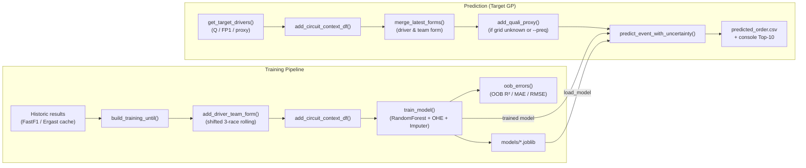

<a id="readme-top"></a>
# F1 Race Predictor *(RF + Uncertainty)*

### Predict Formula 1 finishing order with a leakage-safe feature pipeline, a Random Forest regressor, and built-in uncertainty.

Pulls historical results up to a target Grand Prix, engineers driver/team “form” and circuit context features,
and outputs point predictions with confidence bands. Gracefully handles missing current-weekend data
(e.g., qualifying not yet published).


## Table of Contents

- [Highlights](#highlights)
- [Architecture](#architecture)
- [Project Structure](#project-structure)
- [Installation](#installation)
- [Quickstart](#quickstart)
  - [1) Train & Predict (single shot)](#1-train--predict-single-shot)
  - [2) Save a Trained Model](#2-save-a-trained-model)
  - [3) Predict Using a Saved Model (no retrain)](#3-predict-using-a-saved-model-no-retrain)
  - [4) Pre-Qualifying Mode (force quali proxy)](#4-pre-qualifying-mode-force-quali-proxy)
- [Command Line Flags](#command-line-flags)
- [How It Works](#how-it-works)
  - [Data & Target Drivers](#data--target-drivers)
  - [Feature Engineering (leakage-safe)](#feature-engineering-leakage-safe)
  - [Model & Uncertainty](#model--uncertainty)
  - [Evaluation (OOB)](#evaluation-oob)
  - [Configuration](#configuration)
  - [Saved Model Artifacts](#saved-model-artifacts)
- [Troubleshooting](#troubleshooting)
- [Roadmap](#roadmap)
- [Contributing](#contributing)
- [License](#license)
- [Acknowledgements](#acknowledgements)
- [Handy One-Liners](#handy-one-liners)

## Highlights
- **End-to-end pipeline:** history → driver/team form (leakage-safe) → circuit context → model.  
- **Uncertainty built-in:** per-driver prediction σ, 68%/95% bands, and Monte-Carlo rank probabilities (Top-10, Podium, ±1 rank).  
- **Pre-Quali fallback:** if Q/FP1 are missing, a quali proxy from recent races is used.  
- **Model persistence:** save/load trained pipelines with metadata (feature list, train dates, OOB metrics).  
- **CLI workflow:** one command to train, evaluate, and predict.

<p align="right"><a href="#readme-top">↑ back to top</a></p>


**Example Output (table)**

| driver | team              | grid_pos | pred_finish | pred_rank | pred_std | pi68_low | pi68_high | p_top10 | p_podium | p_rank_pm1 |
|:------:|-------------------|:--------:|:-----------:|:---------:|:--------:|:--------:|:---------:|:-------:|:--------:|:----------:|
| PIA    | McLaren           | 2.33     | 1.71        | 1         | 1.28     | 1.00     | 2.99      | 1.000   | 0.912    | 0.660      |
| NOR    | McLaren           | 1.67     | 2.81        | 2         | 3.07     | 1.00     | 5.88      | 0.996   | 0.624    | 0.624      |
| VER    | Red Bull Racing   | 2.33     | 5.21        | 3         | 4.39     | 1.00     | 9.60      | 0.864   | 0.354    | 0.332      |
| …      | …                 | …        | …           | …         | …        | …        | …         | …       | …        | …          |


<details>
<summary><b>Field notes</b></summary>

- `pred_finish` — expected finishing position (lower = better)
- `pred_std` — per-driver uncertainty from tree dispersion (variance across RF trees)
- `pi68_low` / `pi68_high`, `pi95_low` / `pi95_high` — 68% / 95% predictive intervals
- `p_top10`, `p_podium`, `p_rank_pm1` — Monte Carlo rank probabilities

</details>
<p align="right"><a href="#readme-top">↑ back to top</a></p>

## Architecture




<p align="right"><a href="#readme-top">↑ back to top</a></p>

## Project Structure

```bash
.
├── F1_prediction_system/        # your package
│   ├── __init__.py
│   ├── main.py
│   ├── data.py
│   ├── features.py
│   ├── model.py
│   └── config.py
├── models/                      # saved models (.joblib)
│   └── rf_latest.joblib         # (optional, created by you)
├── docs/                        # images, diagrams, example outputs
│   ├── architecture.mmd         # Mermaid source (optional)
│   ├── architecture.png         # exported diagram (optional)
│   ├── example_output.png       # screenshot of console/table
│   └── banner.png               # project banner (optional)
├── predicted_order.csv          # created by runs (gitignore if you want)
├── requirements.txt
├── Makefile
├── .gitignore
└── README.md
````
---
<p align="right"><a href="#readme-top">↑ back to top</a></p>

## Installation

Python: 3.10+ recommended (tested on 3.13 as well)

Dependencies: pandas, numpy, scikit-learn>=1.1, joblib, fastf1
```bash
# 1) Create and activate a virtual environment
python -m venv .venv

# Windows
. .venv/Scripts/activate

# macOS/Linux
source .venv/bin/activate

# 2) Install packages
pip install -U pip
pip install pandas numpy scikit-learn joblib fastf1

```
On corporate networks, ensure FastF1 can fetch data or pre-warm its cache.

<p align="right"><a href="#readme-top">↑ back to top</a></p>

## Quickstart
## 1) Train & Predict (single shot)
```bash
python -m F1_prediction_system.main --year 2025 --gp "Dutch Grand Prix"
```
This will:

Build training data up to the target GP

Train a RandomForest model and print OOB metrics (R²/MAE/RMSE)

Build the prediction frame for the target GP

Print the Top-10 with uncertainty & probabilities

Save predicted_order.csv to your current working directory

## 2) Save a Trained Model
```bash
python -m F1_prediction_system.main \
  --year 2025 --gp "Dutch Grand Prix" \
  --save_model models/rf_latest.joblib
```
The artifact stores the sklearn pipeline and metadata (feature list, training date range, OOB metrics, etc.).

## 3) Predict Using a Saved Model (no retrain)
```bash
python -m F1_prediction_system.main \
  --year 2025 --gp "Dutch Grand Prix" \
  --load_model models/rf_latest.joblib
```
Add --auto_retrain to retrain if newer data is detected or features changed.
Add --force_load to proceed even if features differ (not recommended).

## 4) Pre-Qualifying Mode (force quali proxy)

When qualifying is missing or you want to simulate pre-Q uncertainty:
```bash
python -m F1_prediction_system.main \
  --year 2025 --gp "Dutch Grand Prix" \
  --preq --proxy_window 3
```

<p align="right"><a href="#readme-top">↑ back to top</a></p>

## Command Line Flags

| Flag              | Type        | Default              | Description                                                                 |
|-------------------|-------------|----------------------|-----------------------------------------------------------------------------|
| `--year`          | `int`       | `2025`               | Target season (e.g., `2025`).                                               |
| `--gp`            | `str`       | `"Dutch Grand Prix"` | Target Grand Prix name.                                                     |
| `--preq`          | `flag`      | `off`                | Force pre-qualifying mode (ignore Q; use quali proxy).                      |
| `--proxy_window`  | `int`       | `3`                  | Rolling window size for the quali proxy (in races).                         |
| `--mc`            | `int`       | `500`                | Monte-Carlo samples for rank probabilities (`0` disables MC).               |
| `--interval`      | `{68,95}`   | `68`                 | Which confidence interval to display in console (`68` or `95`).             |
| `--load_model`    | `path`      | `—`                  | Load a saved model (artifact or plain sklearn Pipeline).                    |
| `--save_model`    | `path`      | `—`                  | Save the trained model artifact (`.joblib`).                                |
| `--auto_retrain`  | `flag`      | `off`                | Retrain if loaded model is stale (newer data) or features changed.          |
| `--force_load`    | `flag`      | `off`                | Use loaded model even if features differ (**not recommended**).             |
| `--weather_csv`   | `path`      | `—`                  | *(Reserved)* CSV with `gp,year,date,rain_prob,track_temp_c`.                |
| `--use_conformal` | `flag`      | `off`                | *(Reserved)* Add split-conformal predictive intervals.                      |
| `--alpha`         | `float`     | `0.20`               | *(Reserved)* Conformal alpha (e.g., `0.20` ≈ 80% interval).                 |

## How It Works
## Data & Target Drivers

Uses all events before the target GP to build the training set.

For the prediction event, tries Qualifying results (driver list & grid).

If missing, falls back to FP1. If still missing, uses the quali proxy.

## Feature Engineering (leakage-safe)

Driver form (3-race): trailing mean of finishes, shifted by 1 (no peeking).

Team form (3-race): team average per race → trailing mean, shifted by 1.

Circuit context: prior sc_prob, vsc_prob, pit_loss from config.py.

Quali proxy: driver’s trailing mean grid over last N races to fill unknown grid_pos.

## Model & Uncertainty

Model: RandomForestRegressor with a preprocessing pipeline:

numeric → median impute

categoricals (team, driver) → one-hot encode

OOB (oob_score=True): fast, leak-resistant diagnostics.

Uncertainty:

Per-driver std from per-tree prediction dispersion.

Optional Monte Carlo sampling → p_top10, p_podium, p_rank_pm1.

68% / 95% intervals as simple normal bands (informative, not calibrated).

## Evaluation (OOB)

Prints OOB R² / MAE / RMSE from RF’s out-of-bag predictions.

For rigorous evaluation, add chronological backtests (see Roadmap).

## Configuration

config.py contains:

HIST_YEARS: list of past seasons to include (e.g., [2023, 2024, 2025])

CIRCUIT_VOL: GP → (sc_prob, vsc_prob, pit_loss_seconds)

Defaults for unknown circuits: DEFAULT_SC, DEFAULT_VSC, DEFAULT_PIT_LOSS

You can extend this with weather/seasonality or other priors as the model evolves.


## Saved Model Artifacts

Artifacts saved via --save_model are joblib files containing:
```bash
import joblib
artifact = joblib.load("models/rf_latest.joblib")
model = artifact["model"]   # sklearn Pipeline (prep + RF)
meta  = artifact["meta"]    # dict: feat_list, train dates, oob, etc.
```

<p align="right"><a href="#readme-top">↑ back to top</a></p>

## Troubleshooting

“No result data … on Ergast” / empty Q/FP1
Normal for very recent sessions. Use --preq to force the quali proxy, or rely on the built-in fallback.

UserWarning: “Skipping features without any observed values … for imputation”
Harmless. A feature had no numeric observations in the training slice; the imputer skips it.

FutureWarning about .fillna downcasting
Harmless with current versions. The code coerces dtypes in relevant paths.

Model not saving
Make sure you passed --save_model with a valid path; folders are created automatically.
Example: --save_model models/rf_latest.joblib

Using saved model but still retraining
You used --auto_retrain and newer data or feature mismatches were detected.
Add --force_load to use the old model anyway (not recommended).


## Roadmap

Backtesting: chronological splits + ranking metrics (Spearman, NDCG@10, Top-k hit rate).

More features: sprint-weekend flag; tyre/pit priors; DRS effectiveness; upgrades; weather merge.

Modeling: try Gradient Boosting (LightGBM/XGBoost) and ranking objectives.

Calibration: split-conformal or quantile forests for coverage-aware intervals.

Experiment tracking: MLflow or simple per-run CSV logs.

Tests: pytest for leakage checks, feature stability, save/load round-trip.

## Contributing

PRs are welcome! Please:

Keep features leakage-safe

Add unit tests for new feature transforms

Document new CLI flags here in the README

## License

Released under the MIT License (see LICENSE).

## Acknowledgements

Data access via FastF1 (which uses Ergast and timing sources).

Inspiration from standard motorsport analytics workflows and the F1 analytics community.

## Handy One-Liners

Train, evaluate, predict, and save
```bash
python -m F1_prediction_system.main \
  --year 2025 --gp "Dutch Grand Prix" \
  --save_model models/rf_latest.joblib
```

Predict using the saved model (no retrain)
```bash
python -m F1_prediction_system.main \
  --year 2025 --gp "Dutch Grand Prix" \
  --load_model models/rf_latest.joblib
```

Pre-Quali simulation with more MC
```bash
python -m F1_prediction_system.main \
  --year 2025 --gp "Dutch Grand Prix" \
  --preq --proxy_window 3 --mc 2000 --interval 95
```
